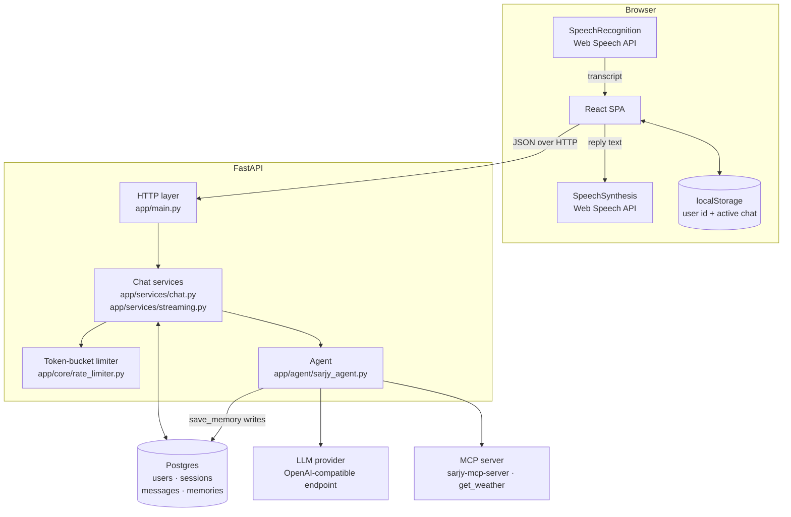
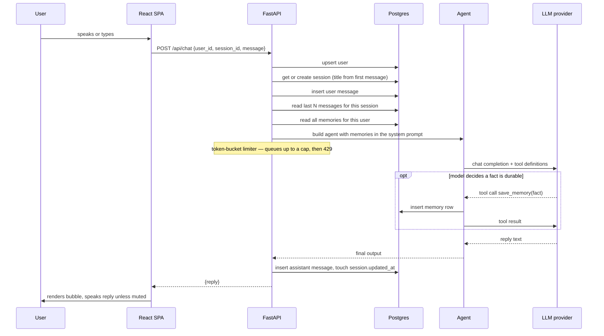
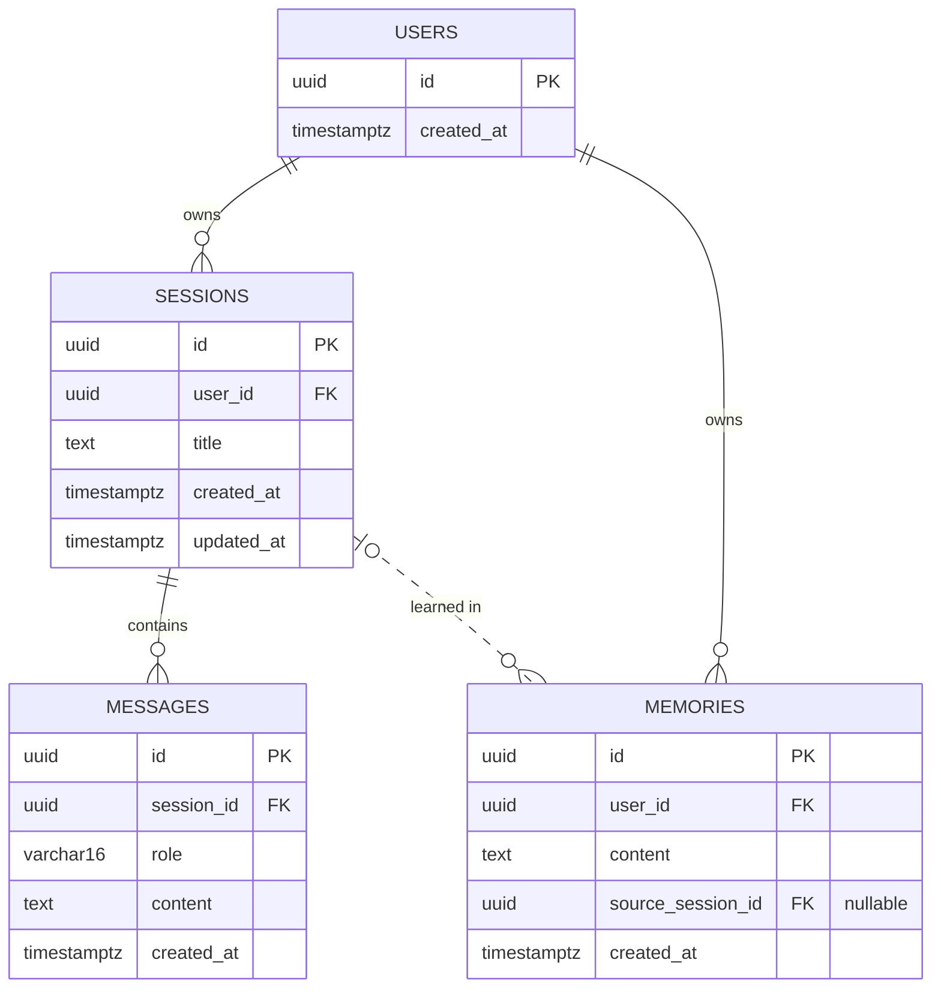

# Sarjy — Architecture

Two independent applications with no shared build tooling: a FastAPI backend
talking to Postgres, and a React single-page app. They meet at a small JSON API.

---

## 1. Component map

Voice never leaves the browser. Both speech-to-text and text-to-speech run on
the client through the Web Speech API, so the server only ever sees text. This
keeps the backend simple, and it is why the app requires Chrome or Edge —
Safari and Firefox do not implement `SpeechRecognition`.

## 2. A chat turn

That is the non-streaming route, kept unchanged as the "before" column of the
latency comparison. It now also returns a `timings` object — `db_read_ms`,
`limiter_wait_ms`, `llm_total_ms`, `db_write_ms`, `total_ms` — so a slow turn on
the deployed app can be attributed without server access.

**The streamed turn.** `POST /api/chat/stream` does the same work and persists
the same rows, but emits `text/event-stream` frames: one `delta` per token, then
a single `done` frame with the full reply and the turn's timings. The browser
speaks each completed sentence as it arrives instead of waiting for the last
token — a user-experience mechanism, not a latency optimization; measured
first-byte timing shows no streaming win, see [`docs/latency/REPORT.md`](latency/REPORT.md).
Three things differ from the diagram above:

- The user message is **committed**, not flushed, before the reads — the history
  read runs in a separate Session and would not otherwise see it.
- History and memory facts are read **concurrently**, each on its own Session,
  since SQLAlchemy's sync Session is not thread-safe.
- The limiter's queue is **bounded** (`llm_rate_limit_max_wait_seconds`). Past
  the cap it raises rather than waiting: a 429 with `Retry-After` on the
  non-streaming route, an `error` frame on the streamed one. An unbounded queue
  was indistinguishable from a hung request.

`llm_ttft_ms` exists only on the streamed path — a non-streamed turn has no
first-token moment to measure.

**Failure handling.** `openai.RateLimitError` is retried on a fixed backoff
(`llm_retry_backoff_seconds`). Any other exception rolls back the transaction
and surfaces as `LLMUnavailableError` → HTTP 502, which the UI shows as an
inline banner. The user message is not persisted when the turn fails.

## 3. Session history

The sidebar and message list read from Postgres. `localStorage` holds only the
user's id and which chat was last open.

| Endpoint | Purpose |
|---|---|
| `GET /api/sessions?user_id=` | Sidebar list, ordered by `updated_at` descending |
| `GET /api/sessions/{id}/messages?user_id=` | Full transcript, ordered by `created_at` ascending |
| `PATCH /api/sessions/{id}?user_id=` | Rename |
| `DELETE /api/sessions/{id}?user_id=` | Delete the session and its messages |
| `POST /api/chat` | One conversational turn |

Session rows are created lazily, on the first message rather than when "New
chat" is clicked, so empty conversations never reach the database. Until then
the chat exists only in browser state.

Every read is scoped by `user_id`, and a session belonging to someone else
returns 404. This is a scoping check, not authentication: `user_id` is a
client-generated UUID and remains spoofable. Accepted tradeoff for a
single-reviewer demo, listed in the PRD's non-goals.

**Full reference.** Swagger UI is at `/docs` and ReDoc at `/redoc` on a running
server. A generated copy of the spec is checked in at
[`openapi.json`](openapi.json) so the API can be read without starting
anything; regenerate it with `python scripts/export_openapi.py` from
`sarjy-backend/` after changing an endpoint or schema.

## 4. Two kinds of memory

The distinction matters and is easy to miss when reading the schema.

| | Recent history | Durable memory |
|---|---|---|
| Table | `messages` | `memories` |
| Scope | One session | One user, all sessions |
| Written by | Every turn, automatically | The model, by calling `save_memory` |
| Read as | Conversation turns passed as `input` | Bullet list injected into the system prompt |
| Bounded by | `chat_history_limit` (default 20) | `memory_facts_limit` (default 20, newest first) |

"Remembers things across sessions" is the `memories` table. The read is capped at the newest `memory_facts_limit` facts because every fact is injected into the system prompt on every turn; unbounded, the prompt grew with every fact ever saved.

## 5. Database schema

Defined in `sarjy-backend/app/models/`, one file per table.

**`users`** — one row per browser that has ever sent a message. `id` is
generated client-side and stored in `localStorage`; the server accepts it as
given.

**`sessions`** — one conversation. `title` is derived server-side from the
first user message, truncated to 30 characters, and can be overwritten by a
rename. `updated_at` is set explicitly on every turn: inserting a message does
not modify the session row, so SQLAlchemy's `onupdate` would never fire and the
sidebar's recency ordering would be wrong.

**`messages`** — the transcript. `role` is `user` or `assistant`; tool calls
are not persisted.

**`memories`** — durable facts. `source_session_id` records where a fact was
learned and is nullable, because a memory outlives the conversation that taught
it.

Indexes: `sessions.user_id`, `messages.session_id`, `memories.user_id`.

### Two schema constraints worth knowing

**No migration tool.** Tables are created by `Base.metadata.create_all` in the
`lifespan` handler in `app/main.py`. A schema change means dropping and
recreating, or writing the SQL by hand. Adequate for a two-day project; Alembic
is what this would need to survive.

**Cascades live in application code.** The foreign keys carry no `ON DELETE`
clause, and because `create_all` does not alter existing tables, adding one
would not apply to a live database. `DELETE /api/sessions/{id}` therefore does
the work explicitly, in one transaction: delete the session's messages, null
`memories.source_session_id` where it points at that session, then delete the
session. Nulling rather than cascading is the load-bearing part — deleting a
conversation must not delete what Sarjy learned from it.

## 6. Configuration

All settings come from the environment via pydantic-settings
(`app/core/config.py`), read from `.env`.

| Setting | Default | Purpose |
|---|---|---|
| `database_url` | local Postgres | SQLAlchemy connection string |
| `cors_origin` | `http://localhost:5173` | Vite dev server |
| `chat_history_limit` | 20 | Messages replayed per turn |
| `llm_rate_limit_per_minute` | 20 | Token-bucket capacity |
| `llm_rate_limit_max_wait_seconds` | 2.0 | Longest a turn queues before the caller is told to retry |
| `memory_facts_limit` | 20 | Newest durable facts injected into the system prompt |
| `use_local_weather_tool` | `false` | Measurement switch for the MCP-overhead A/B |
| `llm_retry_backoff_seconds` | `[1, 2]` | Retry schedule on 429 |

The provider is three env vars — `llm_base_url`, `llm_api_key`, `llm_model` — so
Gemini and Groq swap without a code change. That is config-driven on purpose: an
adapter layer would be indirection around a single live implementation.

## 7. Deployment

Development runs three processes: Postgres in Docker, uvicorn on port 8000, and
the Vite dev server on 5173 proxying `/api` to the backend
(`sarjy-ui/vite.config.js`).

Three packaged shapes exist, all one origin — nginx or Caddy in front, `/api`
proxied to the backend, so there is no CORS anywhere:

- `docker-compose.yml` — the whole application locally on `http://localhost:8080`.
- `docker-compose.prod.yml` + `Caddyfile` — the same stack on a public host, with
  Caddy terminating TLS and obtaining the certificate itself. HTTPS is a
  functional requirement here, not decoration: the browser only grants
  microphone access to the speech input on a secure origin. Runbook:
  [`DEPLOY.md`](DEPLOY.md).
- `Dockerfile` + `render.yaml` at the repo root — the same four processes in one
  image for Render, which runs one image per service rather than a compose file.
  LiteLLM lives in its own virtualenv there, because `litellm[proxy]` pins
  `mcp<2.0.0` while the MCP server needs 2.x.

