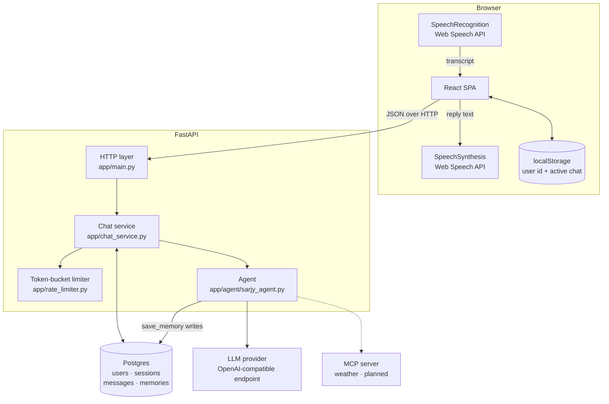
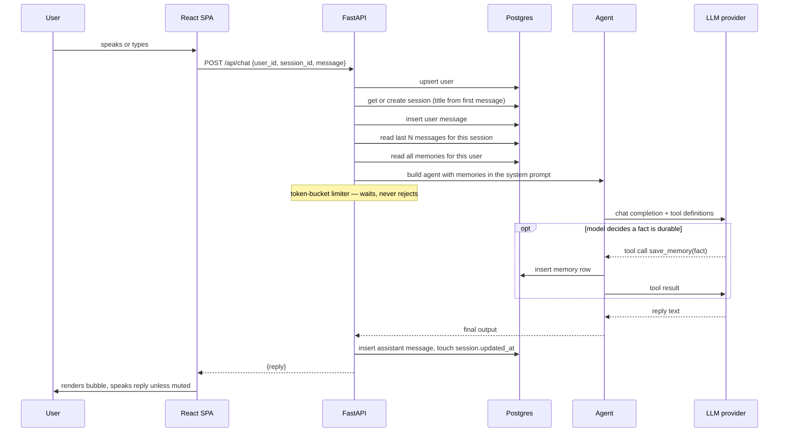
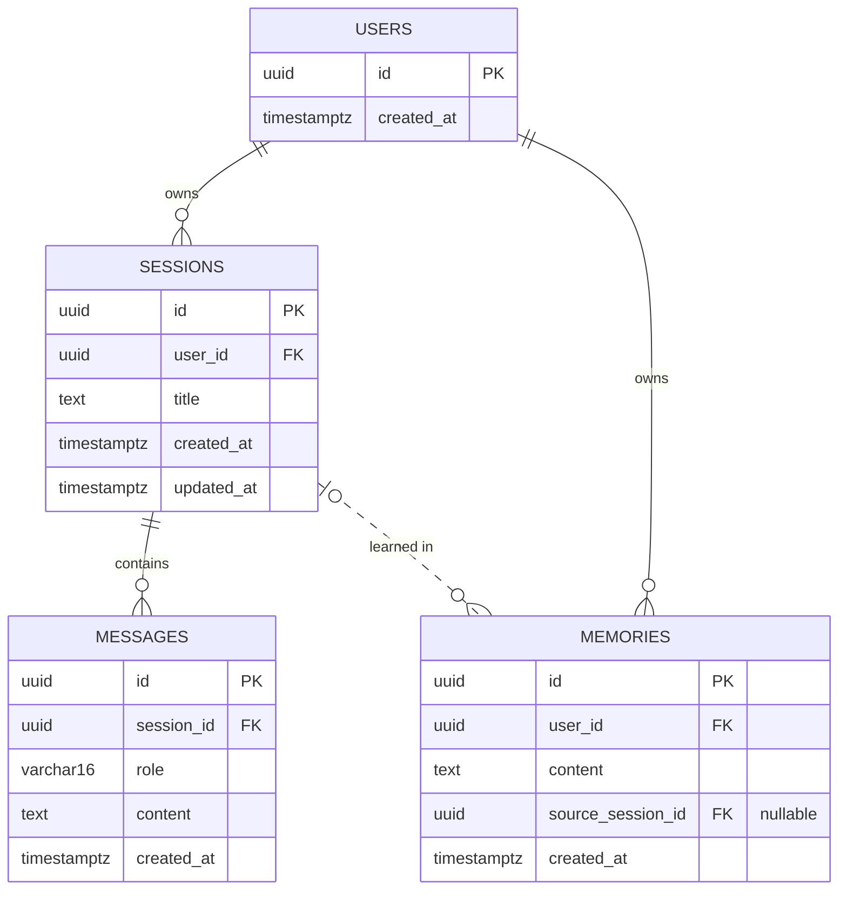

# Sarjy — Architecture

Two independent applications with no shared build tooling: a FastAPI backend
talking to Postgres, and a React single-page app. They meet at a small JSON API.

---

## 1. Component map

Voice never leaves the browser. Both speech-to-text and text-to-speech run on
the client through the Web Speech API, so the server only ever sees text. This
keeps the backend simple, and it is why the app requires Chrome or Edge —
Safari and Firefox do not implement `SpeechRecognition`.

## 2. A chat turn

Everything before the provider call is serial, and the limiter queues rather
than rejecting. Both facts are on the critical path for time-to-first-audio and
are the subject of the latency work.

**Failure handling.** `openai.RateLimitError` is retried on a fixed backoff
(`llm_retry_backoff_seconds`). Any other exception rolls back the transaction
and surfaces as `LLMUnavailableError` → HTTP 502, which the UI shows as an
inline banner. The user message is not persisted when the turn fails.

## 3. Session history

The sidebar and message list read from Postgres. `localStorage` holds only the
user's id and which chat was last open.

| Endpoint | Purpose |
|---|---|
| `GET /api/sessions?user_id=` | Sidebar list, ordered by `updated_at` descending |
| `GET /api/sessions/{id}/messages?user_id=` | Full transcript, ordered by `created_at` ascending |
| `PATCH /api/sessions/{id}?user_id=` | Rename |
| `DELETE /api/sessions/{id}?user_id=` | Delete the session and its messages |
| `POST /api/chat` | One conversational turn |

Session rows are created lazily, on the first message rather than when "New
chat" is clicked, so empty conversations never reach the database. Until then
the chat exists only in browser state.

Every read is scoped by `user_id`, and a session belonging to someone else
returns 404. This is a scoping check, not authentication: `user_id` is a
client-generated UUID and remains spoofable. Accepted tradeoff for a
single-reviewer demo, listed in the PRD's non-goals.

**Full reference.** Swagger UI is at `/docs` and ReDoc at `/redoc` on a running
server. A generated copy of the spec is checked in at
[`openapi.json`](openapi.json) so the API can be read without starting
anything; regenerate it with `python scripts/export_openapi.py` from
`sarjy-backend/` after changing an endpoint or schema.

## 4. Two kinds of memory

The distinction matters and is easy to miss when reading the schema.

| | Recent history | Durable memory |
|---|---|---|
| Table | `messages` | `memories` |
| Scope | One session | One user, all sessions |
| Written by | Every turn, automatically | The model, by calling `save_memory` |
| Read as | Conversation turns passed as `input` | Bullet list injected into the system prompt |
| Bounded by | `chat_history_limit` (default 20) | Unbounded — every fact, every turn |

"Remembers things across sessions" is the `memories` table. The unbounded read
is deliberate for now and is one of the latency interventions: the system prompt
grows with every fact ever saved.

## 5. Database schema

Defined in `sarjy-backend/app/models.py`.

**`users`** — one row per browser that has ever sent a message. `id` is
generated client-side and stored in `localStorage`; the server accepts it as
given.

**`sessions`** — one conversation. `title` is derived server-side from the
first user message, truncated to 30 characters, and can be overwritten by a
rename. `updated_at` is set explicitly on every turn: inserting a message does
not modify the session row, so SQLAlchemy's `onupdate` would never fire and the
sidebar's recency ordering would be wrong.

**`messages`** — the transcript. `role` is `user` or `assistant`; tool calls
are not persisted.

**`memories`** — durable facts. `source_session_id` records where a fact was
learned and is nullable, because a memory outlives the conversation that taught
it.

Indexes: `sessions.user_id`, `messages.session_id`, `memories.user_id`.

### Two schema constraints worth knowing

**No migration tool.** Tables are created by `Base.metadata.create_all` in the
`lifespan` handler in `app/main.py`. A schema change means dropping and
recreating, or writing the SQL by hand. Adequate for a two-day project; Alembic
is what this would need to survive.

**Cascades live in application code.** The foreign keys carry no `ON DELETE`
clause, and because `create_all` does not alter existing tables, adding one
would not apply to a live database. `DELETE /api/sessions/{id}` therefore does
the work explicitly, in one transaction: delete the session's messages, null
`memories.source_session_id` where it points at that session, then delete the
session. Nulling rather than cascading is the load-bearing part — deleting a
conversation must not delete what Sarjy learned from it.

## 6. Configuration

All settings come from the environment via pydantic-settings
(`app/config.py`), read from `.env`.

| Setting | Default | Purpose |
|---|---|---|
| `database_url` | local Postgres | SQLAlchemy connection string |
| `cors_origin` | `http://localhost:5173` | Vite dev server |
| `chat_history_limit` | 20 | Messages replayed per turn |
| `llm_rate_limit_per_minute` | 20 | Token-bucket capacity |
| `llm_retry_backoff_seconds` | `[1, 2]` | Retry schedule on 429 |

**Planned.** The provider becomes three env vars — base URL, key, model — so
Gemini and Groq can be swapped without a code change. That is config-driven on
purpose: an adapter layer would be indirection around a single live
implementation.

## 7. Deployment

Development runs three processes: Postgres in Docker, uvicorn on port 8000, and
the Vite dev server on 5173 proxying `/api` to the backend
(`sarjy-ui/vite.config.js`).

**Planned.** FastAPI serves the built `dist/`, collapsing this to one origin and
one URL — no CORS, and a link a reviewer can open without setup. Target is
Render for the app and Neon for Postgres.

