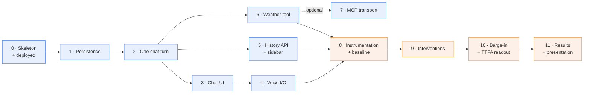

# Sarjy — Implementation Plan

Build order, from an empty repository to a deployed application with the
latency deep dive done. The *what* and *why* are in [`PRD.md`](PRD.md); the
shape of the system is in [`ARCHITECTURE.md`](ARCHITECTURE.md). This document
is only the sequence.

> Written before the deep dive was narrowed to the backend segment. Phases 8 to 10 still describe client-side marks and a time-to-first-audio deliverable; the scope that shipped is in [`PRD.md`](PRD.md) section 5 and the results in [`latency/REPORT.md`](latency/REPORT.md). Kept as the build order it was, not edited to match.

## Two rules the order obeys

**Deploy before there is anything to lose.** Phase 0 puts a trivial but real
application on a public URL. Deployment is the step most likely to surprise —
HTTPS for the microphone, a managed database, build output paths — and finding
that out on day 2 with a finished app is the worst possible time. Every later
phase ships onto a pipeline already known to work.

**Every phase ends in something runnable.** No phase leaves the tree in a state
where the app cannot start. If time runs out mid-plan, whatever is finished is
still demonstrable.

## Dependency graph

Blue is the floor and must be finished and deployed by the end of day 1. Orange
is the deep dive and owns day 2.

---

## Phase 0 — Skeleton on a public URL

**Goal.** A deployed page that talks to a deployed backend. Nothing else.

**Build**
- Repo, `.gitignore`, `README.md`. Draft PR opened on the first push.
- `sarjy-backend/`: FastAPI app with `GET /api/health`, `requirements.txt`,
  `app/config.py` reading `.env` through pydantic-settings.
- `sarjy-ui/`: Vite + React, one page that calls `/api/health` and renders the
  result. Dev proxy for `/api`.
- `docker-compose.yml` at the repo root running Postgres 16.
- Deploy to Render with a Neon Postgres instance attached.

**Done when.** The public URL renders the health response, and the microphone
permission prompt appears in Chrome on that URL — confirming HTTPS is real.

**Risk.** This is where deployment problems surface. That is the point.

---

## Phase 1 — Persistence

**Goal.** The four tables exist and are reachable.

**Build**
- `app/db.py`: engine, `SessionLocal`, `Base`, a `get_db` dependency.
- `app/models.py`: `User`, `Session`, `Message`, `Memory` as described in
  ARCHITECTURE §5, with indexes on the three foreign keys.
- `Base.metadata.create_all` in the FastAPI `lifespan` handler. No migration
  tool — a two-day project does not earn Alembic, and the tradeoff is written
  down rather than forgotten.

**Done when.** Starting the app against a clean database creates all four
tables; `\dt` in psql shows them.

---

## Phase 2 — One chat turn

**Goal.** `POST /api/chat` returns a real model reply and remembers a fact.

**Build**
- `app/agent/sarjy_agent.py`: the agent, its system prompt, and a `save_memory`
  function tool that writes a `Memory` row. A `ChatContext` dataclass carries
  the user id, session id and database session into tool calls.
- Provider wiring: an `AsyncOpenAI` client pointed at a base URL from the
  environment, wrapped in `OpenAIChatCompletionsModel`, tracing disabled. Base
  URL, key and model name are three env vars so Gemini and Groq are a config
  change.
- `app/chat_service.py`: upsert user, get-or-create session with a title
  derived from the first message, persist the user message, read the recent
  history window and the user's memories, run the agent, persist the reply, and
  touch `session.updated_at`.
- `app/rate_limiter.py`: token bucket over outbound model calls.
- Retry on `RateLimitError`; any other failure rolls back and returns 502.

**Done when.** Two `curl` calls in the same session hold context. A third call
with a new session id still recalls a fact stated in the first — that is the
cross-session memory requirement, provable before any UI exists.

**Note.** `session.updated_at` must be set explicitly. Inserting a message does
not modify the session row, so an `onupdate` default never fires and the
sidebar's ordering would be silently wrong.

---

## Phase 3 — Chat UI

**Goal.** A usable text chat.

**Build**
- `src/api.js`: `getUserId()` persisting a UUID in `localStorage`, and
  `sendMessage()` as the single point that calls the backend.
- `src/components/ChatWindow.jsx`, `MessageInput.jsx`: message list with
  distinct user and assistant bubbles, input with Enter-to-send, a typing
  indicator while a request is in flight, and an inline error banner on
  failure.
- `src/App.jsx` as the composition root.

**Done when.** A conversation can be held in the browser and survives a reload
of the page mid-conversation without crashing.

---

## Phase 4 — Voice

**Goal.** The floor's headline requirement.

**Build**
- `src/hooks/useSpeechRecognition.js`: wraps `SpeechRecognition` with the
  `webkitSpeechRecognition` fallback. Feature-detected, never polyfilled. A
  final transcript is sent exactly as a typed message.
- `src/hooks/useSpeechSynthesis.js`: speaks assistant replies, with a mute
  toggle, and cancels in-flight speech when a new message is sent.
- Mic button with idle / listening / processing states; both hooks degrade to a
  text-only interface where unsupported, with a banner naming Chrome.

**Done when.** A spoken question gets a spoken answer on the deployed URL, in
Chrome, with no keyboard involved.

---

## Phase 5 — History API and sidebar

**Goal.** Conversations persist server-side and are manageable.

**Build**
- `GET /api/sessions`, `GET /api/sessions/{id}/messages`,
  `PATCH /api/sessions/{id}`, `DELETE /api/sessions/{id}`, all scoped by
  `user_id` and returning 404 for another user's session.
- Delete cascades in application code: remove the session's messages, null
  `memories.source_session_id`, then remove the session. Memories outlive the
  conversation that taught them.
- `src/hooks/useSessions.js`: server-backed list, messages loaded on demand and
  cached per session, a client-only pending session until its first message.
- `SessionList.jsx`: select, rename inline, delete with a two-click confirm —
  not `window.confirm`, which blocks the page.
- OpenAPI polish: summaries, per-field descriptions, declared error responses.
  Export a copy to `docs/openapi.json`.

**Done when.** Clearing `localStorage` and reloading brings the full history
back from Postgres.

---

## Phase 6 — Weather tool

**Goal.** The floor's external-API requirement.

**Build**
- A `get_weather` function tool calling a public weather API.
- Location resolved from memory. If unknown, Sarjy asks once and saves it via
  `save_memory`.

**Done when.** "What's the weather?" is answered without asking which city, in
a session that never mentioned one — memory and tool use composing, in a single
demo breath.

---

## Phase 7 — MCP transport *(optional, time-boxed to day 1)*

**Goal.** Serve the weather tool over MCP instead of a local function tool.

**Build**
- A small MCP server exposing the weather tool.
- Register it on the agent's `mcp_servers`.

**Done when.** The same weather question is answered with the tool served over
MCP, on the deployed URL — not only locally.

**Abort condition.** If this is not working by the end of day 1, the phase-6
function tool ships and the plan continues at phase 8. Nothing downstream
depends on it.

**Risk.** A stdio server means an extra process inside the deployed container.
This is the phase most likely to work locally and fail in production, which is
why it comes after the floor is already deployed.

---

## Phase 8 — Instrumentation and baseline

**Goal.** Numbers, before changing anything.

**Build**
- Client marks: speech end → request sent → first response byte → first audio.
- Server spans: database time, model time-to-first-token, total handler time,
  returned with the response and logged.
- A repeatable measurement run: one fixed prompt, ten iterations, p50 and p95
  per segment, against the deployed app.

**Done when.** A baseline table exists and is committed. This is the "before"
column, and it cannot be reconstructed later.

**This phase is not optional.** Skipping it leaves a faster application and no
deep dive.

---

## Phase 9 — Interventions

Work in expected order of payoff, re-measuring after each. Record results that
show no improvement — those are the more interesting rows.

1. Stream the response over SSE; flush to speech at the first sentence
   boundary. Expected to be the largest win.
2. Cap the rate limiter's queue wait, or remove it for the demo. It adds
   latency by design.
3. Parallelise the pre-model reads; defer writes until after the response has
   started.
4. Bound the injected memory facts and the history window — fewer input tokens,
   faster first token.
5. Tune STT endpointing so the final transcript arrives sooner. Dead air here
   is time no backend work can recover.
6. Warm the speech-synthesis voice list at page load.
7. Compare Gemini against Groq on the same harness.
8. Measure MCP per-call overhead against the plain function tool, if phase 7
   landed.

**Done when.** Every intervention has a measured before and after.

---

## Phase 10 — Barge-in and the TTFA readout

**Goal.** The parts of latency that are felt rather than measured.

**Build**
- Barge-in: speaking over Sarjy cuts the speech immediately and starts a new
  turn.
- A live time-to-first-audio readout in the UI, plus a per-turn waterfall.

**Done when.** Interrupting mid-sentence works on the deployed URL, and the
readout updates per turn.

---

## Phase 11 — Results and presentation

**Goal.** The thing the reviewer actually sees first.

**Build**
- The before/after table by segment, including what did not help.
- A short Loom or PDF, shared before the meeting.
- The five-minute talk. They stop at five minutes and thirty seconds.

**Reserve the last 90 minutes of day 2 for this and do not spend it on code.**

---

## Cut order

If day 2 runs short, drop from the bottom of this list first:

1. MCP overhead measurement (phase 9.8)
2. Provider comparison (phase 9.7)
3. TTS voice warming (phase 9.6)
4. Memory and history trimming (phase 9.4)

Phases 8, 9.1 and 11 are not cuttable. Without instrumentation there is no deep
dive; without streaming there is no result; without the presentation there is
nothing to show for either.

## Verification

There is no automated test suite — a deliberate cut, recorded in the PRD's
non-goals. Verification is per phase, as written in each "done when" above, and
each is a check that can be run against the deployed URL rather than only
localhost. The one scripted check worth keeping is a small script that exercises
the session endpoints against a throwaway database, since the delete cascade is
the piece most likely to break silently.
